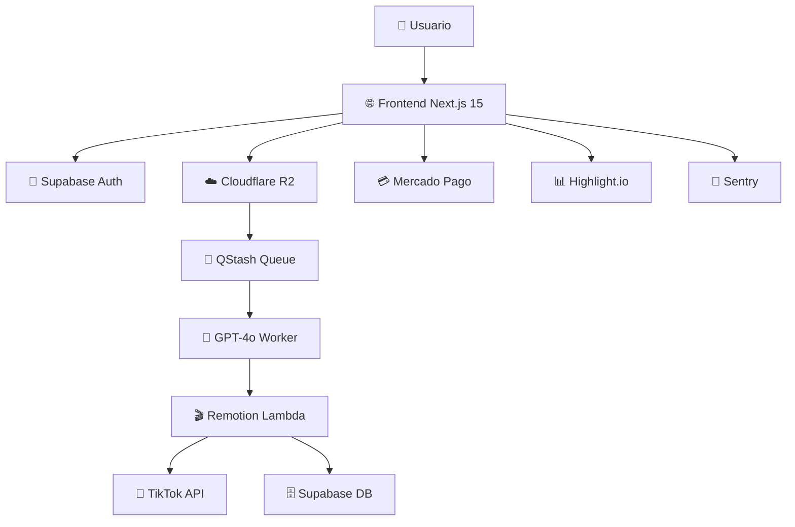

# 🎬 Reelizalo - AI-Powered Video Content Generator

**Reelizalo** es una plataforma SaaS que transforma fotos de productos en videos virales de TikTok usando IA y templates predefinidos.

## 🏗️ Arquitectura del Sistema



## 🛠️ Stack Tecnológico

### Frontend
- **Next.js 15** - Framework React con App Router
- **TypeScript** - Tipado estático
- **Tailwind CSS** - Utilidades CSS
- **shadcn/ui** - Componentes accesibles (built on Radix UI)

### Backend & Servicios
- **Supabase** - Base de datos PostgreSQL + Auth
- **OpenAI GPT-4o** - Generación de storyboards
- **Remotion Lambda** - Renderizado de videos
- **Upstash Redis + QStash** - Colas y cache
- **Cloudflare R2** - Almacenamiento de archivos

### Integraciones
- **TikTok API** - Publicación automática
- **Mercado Pago** - Pagos LATAM (PEN)
- **Highlight.io** - Monitoreo de performance
- **Sentry** - Error tracking

## 📁 Estructura del Proyecto

```
reelizalo/
├── src/
│   ├── app/                    # Next.js App Router
│   │   ├── api/               # API Routes
│   │   │   ├── auth/          # Autenticación
│   │   │   ├── videos/        # Gestión de videos
│   │   │   ├── billing/       # Facturación
│   │   │   └── webhooks/      # Webhooks externos
│   │   ├── dashboard/         # Dashboard principal
│   │   ├── onboarding/        # Proceso de onboarding
│   │   └── pricing/           # Página de precios
│   ├── components/            # Componentes React
│   │   ├── ui/               # shadcn/ui components
│   │   ├── auth/             # Componentes de auth
│   │   ├── dashboard/        # Dashboard components
│   │   ├── upload/           # Upload de archivos
│   │   └── video-preview/    # Preview de videos
│   ├── lib/                  # Librerías y configuración
│   │   ├── supabase/         # Cliente Supabase
│   │   ├── openai/           # Cliente OpenAI
│   │   ├── remotion/         # Configuración Remotion
│   │   ├── qstash/           # Cliente QStash
│   │   ├── mercadopago/      # Cliente Mercado Pago
│   │   ├── highlight/        # Configuración Highlight
│   │   └── sentry/           # Configuración Sentry
│   ├── types/                # Definiciones TypeScript
│   └── remotion/             # Templates de video
│       ├── compositions/     # Composiciones Remotion
│       └── assets/           # Assets para videos
├── public/                   # Archivos estáticos
├── prisma/                   # Schema de base de datos
└── docs/                     # Documentación
```

## 🔄 Flujo de Trabajo (Workflow)

### 1. **Carga de Producto** 📤
```
Usuario → Upload de fotos → Cloudflare R2 → Metadatos en Supabase
```

### 2. **Generación de Storyboard** 🧠
```
QStash Queue → GPT-4o Worker → JSON Storyboard → Supabase DB
```

### 3. **Renderizado de Video** 🎬
```
Remotion Lambda → FFmpeg → Video MP4 → Cloudflare R2
```

### 4. **Publicación** 📱
```
TikTok API → Publicación automática → Analytics → Dashboard
```

## 📦 Gestión de Dependencias

### Filosofía de Dependencias
1. **Versiones Fijas** - Sin `^` o `~` para evitar actualizaciones accidentales
2. **Dependencias Mínimas** - Solo lo esencial para reducir bundle size
3. **Auditorías Regulares** - Revisión mensual de seguridad y performance
4. **Testing Exhaustivo** - Cada actualización debe pasar todos los tests

### Categorización de Dependencias

#### 📦 **Production Dependencies**
```json
{
  "next": "15.3.4",                    // Framework principal
  "react": "^19.0.0",                  // React 19
  "@supabase/supabase-js": "^2.45.1",  // Database & Auth
  "openai": "^4.56.0",                 // IA para storyboards
  "remotion": "^4.0.124",              // Video rendering
  "@upstash/redis": "^1.25.1",         // Cache y colas
  "mercadopago": "^2.0.6",             // Pagos LATAM
  "zod": "^3.23.8",                    // Validación de schemas
  "lucide-react": "^0.441.0"           // Iconos
}
```

#### 🔧 **Development Dependencies**
```json
{
  "typescript": "^5",                   // Tipado estático
  "tailwindcss": "^3.4.1",            // CSS utilities
  "eslint": "^8",                      // Linting
  "vitest": "latest",                  // Testing framework
  "playwright": "latest",              // E2E testing
  "supabase": "^1.191.0"               // CLI tools
}
```

#### 🎨 **UI Dependencies** (shadcn/ui ecosystem)
```json
{
  "@radix-ui/react-dialog": "^1.1.1",      // Modal components
  "@radix-ui/react-dropdown-menu": "^2.1.1", // Dropdown menus
  "@radix-ui/react-progress": "^1.1.0",     // Progress bars
  "class-variance-authority": "^0.7.0",     // Component variants
  "tailwind-merge": "^2.5.2"                // Tailwind utilities
}
```

### Dependencias Específicas por Módulo

#### 🤖 **AI & Processing**
- `openai` - GPT-4o para storyboards
- `@remotion/lambda` - Renderizado serverless
- `ffmpeg` - Procesamiento de video

#### 🔐 **Auth & Database**
- `@supabase/supabase-js` - Cliente principal
- `@supabase/auth-helpers-nextjs` - Next.js helpers

#### 📊 **Monitoring & Analytics**
- `@highlight-run/next` - Performance monitoring
- `@sentry/nextjs` - Error tracking

#### 💳 **Payments**
- `mercadopago` - Pagos LATAM
- `stripe` (futuro) - Pagos internacionales

### Comandos de Gestión de Dependencias

```bash
# Instalación con versiones fijas
npm install --save-exact <package>

# Auditoría de seguridad
npm audit --audit-level moderate

# Actualización controlada
npm update --save-exact

# Verificación de duplicados
npx npm-check-duplicates

# Análisis de bundle size
npx @next/bundle-analyzer
```

## 🚀 Plan de Desarrollo MVP (4 Semanas)

### **Semana 1: Fundación** 🏗️
- ✅ Setup Next.js 15 + TypeScript
- ✅ Configuración shadcn/ui
- ✅ Estructura de carpetas
- ⏳ Configuración Supabase
- ⏳ Auth flow básico
- ⏳ UI Components base

### **Semana 2: Core Features** 🔧
- ⏳ Upload de archivos (Cloudflare R2)
- ⏳ Integración GPT-4o
- ⏳ Sistema de colas (QStash)
- ⏳ Remotion setup básico
- ⏳ Database schema

### **Semana 3: Video Engine** 🎬
- ⏳ Templates de video Remotion
- ⏳ Renderizado Lambda
- ⏳ Integración TikTok API
- ⏳ Dashboard de videos
- ⏳ Preview components

### **Semana 4: Production Ready** 🚀
- ⏳ Mercado Pago integration
- ⏳ Monitoring (Highlight + Sentry)
- ⏳ Testing (Vitest + Playwright)
- ⏳ Deployment Vercel
- ⏳ Performance optimization

## 🧪 Testing Strategy

### Unit Tests (Vitest)
```bash
npm run test              # Run all tests
npm run test:watch        # Watch mode
npm run test:coverage     # Coverage report
```

### E2E Tests (Playwright)
```bash
npm run test:e2e          # Headless mode
npm run test:e2e:ui       # UI mode
```

### API Tests
```bash
npm run test:api          # API integration tests
```

## 📊 Performance Monitoring

### Metrics Clave
- **Time to First Byte (TTFB)** < 200ms
- **Largest Contentful Paint (LCP)** < 2.5s
- **First Input Delay (FID)** < 100ms
- **Cumulative Layout Shift (CLS)** < 0.1

### Herramientas
- **Highlight.io** - Real-time monitoring
- **Sentry** - Error tracking
- **Vercel Analytics** - Core Web Vitals

## 🔐 Seguridad

### Medidas Implementadas
- **Row Level Security (RLS)** en Supabase
- **API Rate Limiting** con Upstash
- **Input Validation** con Zod
- **CORS Configuration** para APIs
- **Environment Variables** para secrets

## 💰 Modelo de Costos (MVP)

### Servicios (Estimado mensual)
- **Vercel Pro**: $20/mes
- **Supabase Pro**: $25/mes
- **Cloudflare R2**: $15/mes (1TB)
- **OpenAI API**: $50/mes (estimado)
- **Remotion Lambda**: $30/mes
- **Upstash**: $10/mes
- **Highlight.io**: $29/mes
- **Sentry**: $26/mes

**Total estimado**: ~$205/mes para 1000 usuarios activos

## 📚 Scripts Disponibles

```bash
# Desarrollo
npm run dev               # Servidor desarrollo
npm run build             # Build producción
npm run start             # Servidor producción

# Base de datos
npm run db:generate       # Generar tipos Supabase
npm run db:reset          # Reset database
npm run db:seed           # Seed data

# Video rendering
npm run remotion:studio   # Remotion studio
npm run remotion:render   # Render videos

# Testing
npm run test              # Unit tests
npm run test:e2e          # E2E tests
npm run lint              # ESLint
npm run type-check        # TypeScript check

# Deployment
npm run deploy            # Deploy a Vercel
```

## 🤝 Contribución

1. Fork el repositorio
2. Crea una rama: `git checkout -b feature/nueva-funcionalidad`
3. Commitea cambios: `git commit -m 'feat: nueva funcionalidad'`
4. Push a la rama: `git push origin feature/nueva-funcionalidad`
5. Abre un Pull Request

## 📄 Licencia

Este proyecto está bajo la licencia MIT. Ver `LICENSE` para más detalles.

---

**Desarrollado con ❤️ para revolucionar el marketing de productos en TikTok**
